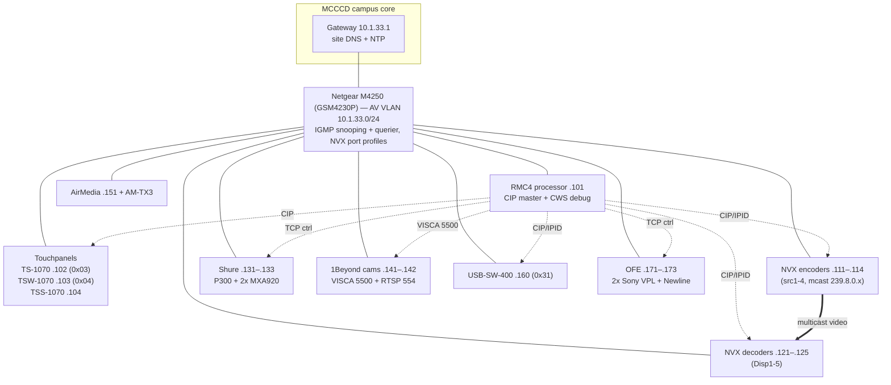

# Network Schema — MCCCD AA140 Main Conference Room

**Room:** AA140 Main Conference Room
**Project:** MCCCD-AA140 Touchpanel (FRED `c1937681-e57d-4354-aa58-a5b0f6e9ca23`)
**Status:** PROPOSED — drafted 2026-06-25. Modeled on the AC203 satellite-room schema.
**Companion docs:** `IP-Address-Plan.md` (device address inventory) · this file = topology + VLAN + the new 10.1.33.x addressing.

> **This is a plan, not the running config.** The code today still uses the legacy
> `192.168.1.x` / `192.168.2.x` addresses (see §5). Re-IP is a separate, gated
> migration (§6) — nothing is changed in code by this document.

---

## 1. Network design

- **AV VLAN:** `10.1.33.0/24`, gateway `.1`, **static** addressing — **shared** with the
  AC203 satellite room (AC203 uses `.11–.17`; AA140 takes the **`.101+`** block so the
  two rooms never collide).
- **DNS / NTP:** site resolver + site NTP **required** — *not* a public resolver, to
  preserve AD / Teams Rooms logins. ⚠️ **Memory flags DNS currently `0.0.0.0`** on the
  AA140 gear — must be set to the MCCCD site DNS at commissioning or AirMedia/Teams/AD
  auth will fail.
- **Multicast (DM NVX):** AA140 is NVX-heavy (unlike AC203, which has none). The AV VLAN
  needs an **IGMP querier + IGMP snooping** so NVX multicast (`239.8.0.0/.4/.8/.12`)
  doesn't flood. AC203 adds no multicast load to this VLAN, so no cross-room contention.
- **Subnet-unification win:** putting the RMC4 processor and the 1Beyond cameras on the
  same `/24` resolves the camera **control-source `/24` limit** (the cameras only accept
  control from their own subnet) — the legacy split `.1.x`/`.2.x` no longer applies.
- **Switch:** Netgear M4250 (GSM4230P), Crestron-tuned NVX profiles. Mgmt IP `.2`.

---

## 2. Topology

---

## 3. Proposed address map (10.1.33.0/24, AA140 = `.101+`)

Legend: **IPID** = Crestron CIP logical binding · **mcast** = NVX video multicast group ·
🔴 = a legacy in-code conflict this migration resolves.

### Infrastructure (below .101)
| Device | New IP | Notes |
|---|---|---|
| Gateway | `10.1.33.1` | site DNS/NTP |
| M4250 AV switch (mgmt) | `10.1.33.2` | IGMP querier for this VLAN |

### Control & UI (.101–.109)
| Device | Model | New IP | Legacy IP | IPID | Notes |
|---|---|---|---|---|---|
| Control processor | RMC4 | `10.1.33.101` | `.1.191`/`.2.198` 🔴 | host | CWS debug `https://10.1.33.101/cws/aa140/debug/ui`; resolves the `.1.191`-vs-`.2.198` conflict |
| Tabletop panel | TS-1070-B-S | `10.1.33.102` | `.2.80` | 0x03 | confirm IPID strapping (code comment disagrees) |
| Wall panel | TSW-1070-B-S | `10.1.33.103` | `.2.78` | 0x04 | |
| Scheduling panel | TSS-1070-B-S | `10.1.33.104` | none | — | standalone scheduler |

### AV-over-IP — DM NVX (.111–.125, IPID-bound)
| Device | Model | New IP | IPID | mcast | Notes |
|---|---|---|---|---|---|
| Enc — Room PC (src1) | DM-NVX-E30 | `10.1.33.111` | 0x11 | 239.8.0.0 | |
| Enc — Ext/Laptop (src2) | DM-NVX-E30 | `10.1.33.112` | 0x12 | 239.8.0.4 | |
| Enc — AirMedia (src3) | DM-NVX-E30 | `10.1.33.113` | 0x13 | 239.8.0.8 | |
| Enc — HDMI/USB-C (src4) | DM-NVX-384 | `10.1.33.114` | 0x14 | 239.8.0.12 | 🔴 in code but absent from BOM — confirm exists/OFE |
| Dec — Display 1 | DM-NVX-D30 | `10.1.33.121` | 0x21 | — | |
| Dec — Display 2 | DM-NVX-D30 | `10.1.33.122` | 0x22 | — | |
| Dec — Display 3 | DM-NVX-D30 | `10.1.33.123` | 0x23 | — | |
| Dec — Display 4 (podium) | DM-NVX-D30 | `10.1.33.124` | 0x24 | — | |
| Dec — Display 5 (signage) | DM-NVX-D30 | `10.1.33.125` | 0x25 | — | independently routed |

### Audio — Shure (.131–.133) — ✅ LIVE on new IPs (verified 2026-06-26)
| Device | Model | New IP | Legacy IP | Source file |
|---|---|---|---|---|
| Conferencing DSP | P300-IMX | `10.1.33.131` ✅ | `.2.151` | `ShureP300Service.cs:24` (applied) |
| Ceiling mic A | MXA920W-S | `10.1.33.132` ✅ | `.2.181` | `ShureMxaService.cs:27` (applied) |
| Ceiling mic B | MXA920W-S | `10.1.33.133` ✅ | `.2.182` | `ShureMxaService.cs:28` (applied) |

> The three Shure devices answer the Shure-ASCII control protocol on `:2202` at the new IPs (P300 `AA140-P300-DSP-01` FW 6.9.0.104; arrays `AA140-CM-01`/`-02`). This is the **first executed slice** of the re-IP; the rest of the schema remains PROPOSED. See `Network-ReIP-Code-Changes.md` for status.

### Cameras — 1Beyond (.141–.142, VISCA TCP 5500 + RTSP 554)
| Device | Model | New IP | Legacy IP | Source files |
|---|---|---|---|---|
| PTZ Front | IV-CAM-I20-B | `10.1.33.141` | `.2.174` | `CameraService.cs:62`, `cameras.ts:20`, `DeviceConfigStore:53` |
| PTZ Back | IV-CAM-I12-B | `10.1.33.142` | `.2.173` | `CameraService.cs:63`, `cameras.ts:21`, `:54` |

### Wireless presentation (.151–.153)
| Device | Model | New IP | Legacy IP | Notes |
|---|---|---|---|---|
| AirMedia receiver | AM-3200-WF | `10.1.33.151` | `.1.177` | `AirMediaService.cs:23` |
| Connect transmitter | AM-TX3-200 | `10.1.33.152` | — | pairs to receiver; static usually not required (reserve) |
| Connect adaptor | AM-TX3-100 | `10.1.33.153` | — | pairs to receiver (reserve) |

### USB routing (.160)
| Device | Model | New IP | IPID | Notes |
|---|---|---|---|---|
| BYOD USB matrix | USB-SW-400 | `10.1.33.160` | 0x31 | `UsbSwitchService`; needs an IP |

### OFE — owner-furnished, network-controlled (.171–.173)
| Device | New IP | Legacy IP | Source file | Notes |
|---|---|---|---|---|
| Sony VPL projector 1 | `10.1.33.171` | `.2.161` 🔴 | `SonyVplService.cs:30` | DCS had `.191` (disabled) — align |
| Sony VPL projector 2 | `10.1.33.172` | `.2.162` 🔴 | `SonyVplService.cs:31` | DCS had `.192` (disabled) — align |
| Newline interactive | `10.1.33.173` | `.2.171` 🔴 | `NewlineService.cs:25` | confirm control port; DCS had `.195` (disabled) — align |

Capacity: AA140 uses `.101–.173` (≈30 addresses incl. reserves) + AC203 `.11–.17` — well within a /24.

---

## 4. M4250 port map (to fill at commissioning)
| Port | Device | PoE | VLAN | NVX profile |
|---|---|---|---|---|
| 1 | RMC4 | — | 33 | — |
| 2–3 | TS-1070 / TSW-1070 | PoE+ | 33 | — |
| … | NVX E30/D30 ×9 | — | 33 | NVX |
| … | MXA920 ×2 | PoE+ | 33 | — |
| … | AM-3200 | PoE+ | 33 | — |
| uplink | campus core | — | tagged | — |

> Total PoE budget = panels (2) + MXA920 (2) + AM-3200 (1) + any PoE cameras. Confirm against M4250 budget.

---

## 5. Current hardcoded IPs (authoritative, scanned 2026-06-25)
The values the re-IP must change. (No NVX/USB-SW unicast IPs in code — they bind by IPID.)

| Source | Line | Current |
|---|---|---|
| `MCCCD-AA140/package.json` | 13 | `PANEL_HOST=192.168.2.80` (tabletop) |
| `MCCCD-AA140/package.json` | 14 | `PANEL_HOST=192.168.2.78` (wall) |
| `MCCCD-AA140-SIMPL/scripts/deploy.py` | 23 | `PROC_HOST` default `192.168.1.191` |
| `AirMediaService.cs` | 23 | `192.168.1.177` |
| `CameraService.cs` | 62-63 | `192.168.2.174`, `.173` (+ stale comment :12) |
| `NewlineService.cs` | 25 | `192.168.2.171` |
| `ShureP300Service.cs` | 24 | `192.168.2.151` |
| `ShureMxaService.cs` | 27-28 | `192.168.2.181`, `.182` |
| `SonyVplService.cs` | 30-31 | `192.168.2.161`, `.162` |
| `Debug/DeviceConfigStore.cs` | 46-54 | p300/mxa/sony/newline/airmedia/cam set (some disabled, drifted) |
| `src/lib/cameras.ts` | 20-21 | `192.168.2.174`, `.173` |

---

## 6. Migration plan (re-IP — gated, NOT executed by this doc)

**Branch:** `feat/network-reip-10.1.33` (this branch, off backed-up `main` @ `1b14108`).

1. **Confirm with MCCCD network team** before touching anything:
   - The `10.1.33.0/24` AV VLAN exists and AA140 may use `.101+`.
   - Site **DNS + NTP** server addresses (fixes the `0.0.0.0` DNS flag).
   - IGMP querier is enabled on the VLAN (NVX requirement).
2. **Set device static IPs** at commissioning (hardware/web UIs): processor, panels,
   NVX enc/dec, mics, cameras, AirMedia, USB-SW, projectors, Newline, switch mgmt.
3. **Update code constants** to match (one commit per concern):
   - Panel deploy: `package.json` `PANEL_HOST` → `.102` / `.103`.
   - Processor deploy: `deploy.py:23` default → `10.1.33.101` (or always pass `PROC_HOST`).
   - Backend service constants: AirMedia, Camera (+comment), Newline, ShureP300, ShureMxa, SonyVpl.
   - `DeviceConfigStore.cs`: align all hosts to the new map; decide `enabled` flags
     (resolve the Sony/Newline service-vs-DCS conflicts to the new `.171/.172/.173`).
   - Panel `cameras.ts:20-21` → `.141` / `.142`.
   - Resolve IPID strapping disagreement (TS-1070 0x03 vs code comment).
4. **Build + deploy** to the re-IP'd gear: `npm run deploy:both` (panels),
   `PROC_HOST=10.1.33.101 python scripts/deploy.py` (processor `.cpz`).
5. **Verify** via the CWS debug `/devices` probe (`DeviceProbe`) + on-glass: every host
   reachable, NVX routes, cameras (VISCA + RTSP), mics, AirMedia, projectors.

**Risks / watch-items:**
- DNS `0.0.0.0` → must be a real site resolver or AirMedia/Teams/AD auth breaks.
- IGMP querier mandatory for NVX multicast on the shared VLAN.
- AM-TX3 pairing to the re-IP'd AM-3200 receiver.
- Static-IP cutover is all-or-nothing per device — coordinate so the processor can still
  reach panels mid-migration (deploy panels + processor together).

---

## 7. Open questions for Jordan / MCCCD
1. VLAN `10.1.33.0/24` confirmed for AA140 at `.101+`? (assumed per direction 2026-06-25)
2. Site DNS + NTP addresses?
3. M4250 IGMP querier on — and full port map / PoE budget?
4. DM-NVX-384 (src4): does it physically exist (absent from BOM)?
5. TSS-1070 scheduler — in scope on this VLAN, or owner-managed?
6. Newline control port (AC203 Sharp used `:10008`; confirm Newline's).
